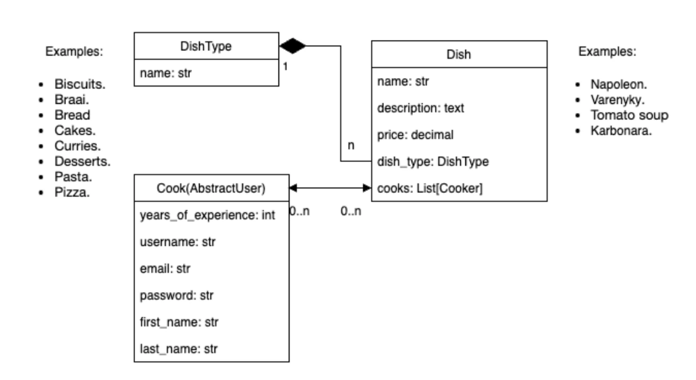
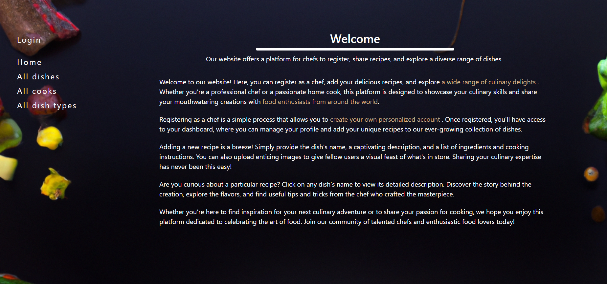
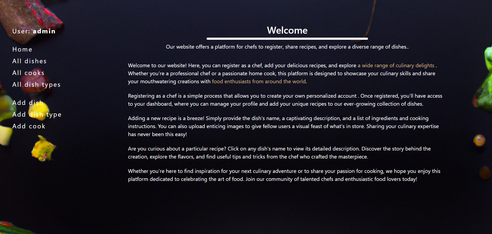
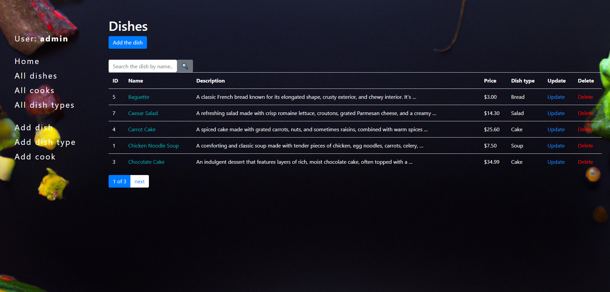
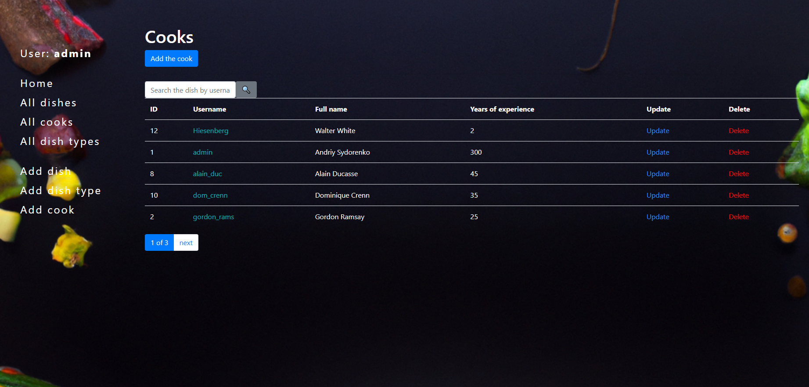
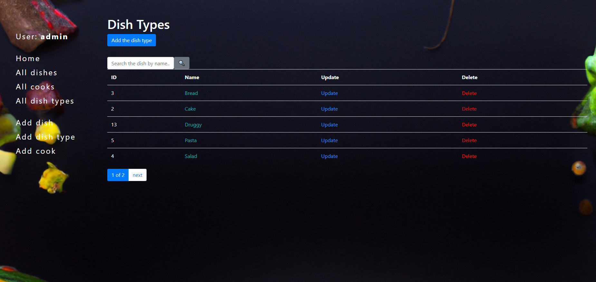

# Restaurant webservice
> It's a website where you can share your favourite recipes and upgrade your cooking skills.

## Features
* Chef Registration: Aspiring chefs can easily sign up and create their profiles, showcasing their culinary specialties.
* Add a Dish: Chefs can add their signature dishes to the platform, along with detailed recipes and descriptions.
* Explore Dishes: Users can browse through a wide range of dishes uploaded by various chefs, learning about different cuisines and cooking styles.
* Search: Users can use search option to find specific dishes or chefs.

## Links

- Repository: https://github.com/Andriy-Sydorenko/restaurant_webservice
- Issue tracker: https://github.com/Andriy-Sydorenko/restaurant_webservice/issues
  - In case of sensitive bugs like security vulnerabilities, please contact
    sidorenkoandrij217@gmail.com directly instead of using issue tracker. I value your effort
    to improve the security and privacy of this project!

- Here is the link to the deployed website: https://restaurant-webservice.onrender.com

## Installing / Getting started

To see the website itself, you can check out my website at the [link above](https://restaurant-webservice.onrender.com)
It is not necessary to create a new account, you can use test one.
* Login: user
* Password: user12345

A quick introduction of the setup you need to get run a project.
1. Fork a repo.
2. Use this command ```git clone the-link-from-your-forked-repo```. 
   - You can get the link by clicking the Clone or download button in your repo.
3. Open the project folder in your IDE.
4. Open a terminal in the project folder. 
5. If you are using PyCharm - it may propose you to automatically create venv for your project and install requirements in it, but if not:
    - For Windows:
    ```shell
    python -m venv venv
    venv\Scripts\activate
    pip install -r requirements.txt
    ```
   - For Mac OS:
    ```shell
    python -m venv venv
    source venv/bin/activate
    pip install -r requirements.txt
    ```
---
> Note: project supports PostgreSQL databases, if you want to switch from sqlite to postgresql, 
> check [settings.py](restaurant_service/settings.py) file, there's already the solution for this.
---
6. Configure .env file as shown in the [.env.sample](.env.sample) file (DON'T use quotes for the parameters, otherwise they will not work)


7. Migrate existing migrations files, using
    ```shell
    python manage.py migrate
    ```


8. Create superuser to see extended functionality of the website:
    ```shell
    python manage.py createsuperuser
    ```
    Also, you can create a regular user, using registration form on the website.


9. Then, to run a project, use this command:
    ```shell
    python manage.py runserver 
    ```

## Links

- Repository: https://github.com/Andriy-Sydorenko/restaurant_webservice
- Issue tracker: https://github.com/Andriy-Sydorenko/restaurant_webservice/issues
  - In case of sensitive bugs like security vulnerabilities, please contact
    sidorenkoandrij217@gmail.com directly instead of using issue tracker. I value your effort
    to improve the security and privacy of this project!
- Here is the link to the deployed website: https://restaurant-webservice.onrender.com

## DB Structure


## Website screenshots





## Licensing
"The code in this project is licensed under MIT license."
